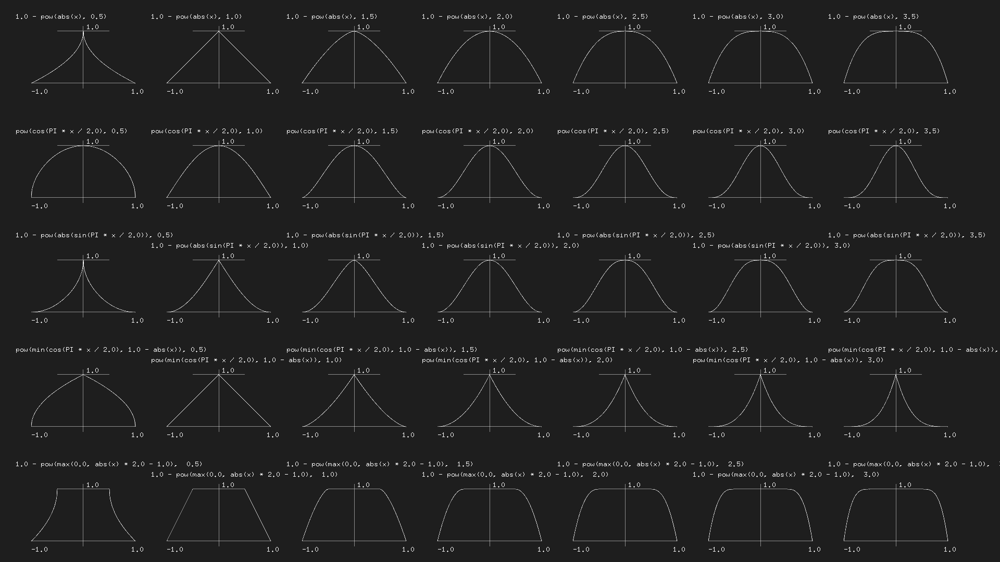

# Step and Smoothstep
- GLSL has some unique native interpolation functions that are hardware accelerated

- `step()`: interpolation receives two parameters
    1. the limit/ threshold
    2. value desired to check/pass. 
    * any value under the limit will return 0.0 and everything above will return 1.0

- `smoothStep()`: given a range of two numbers and a value, interpolates the value between the defined range
    - takes 3 paramters
    1. beginning of transition
    2. end of transition
    3. value to interpolate

# Sine and Cosine
- useful for using math to animate, shape, blend values, construct circles
- given an angle (in radians), will return the corrct position of x (cosine) and y (sine) of a point o nthe edge of a circle with a radius equal to 1.
- returns normalized values (values between -1 and 1)

## Practice
- recreate mathematical graphs 

## Additional Resources
- [Polynomial Shaping Functions](www.flong.com/texts/code/shapers_poly)
- [Exponential Shaping Functions](www.flong.com/texts/code/shapers_exp)
- [Circular & Elliptical Shaping Functions](www.flong.com/texts/code/shapers_circ)
- [Bezier and Other Parametric Shaping Functions](www.flong.com/texts/code/shapers_bez)
- [Inigo Quiles](http://www.iquilezles.org/www/articles/functions/functions.htm)